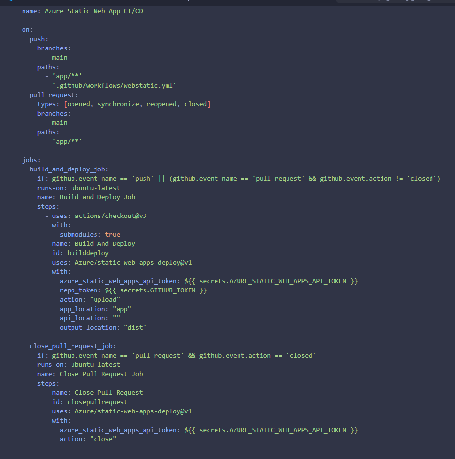
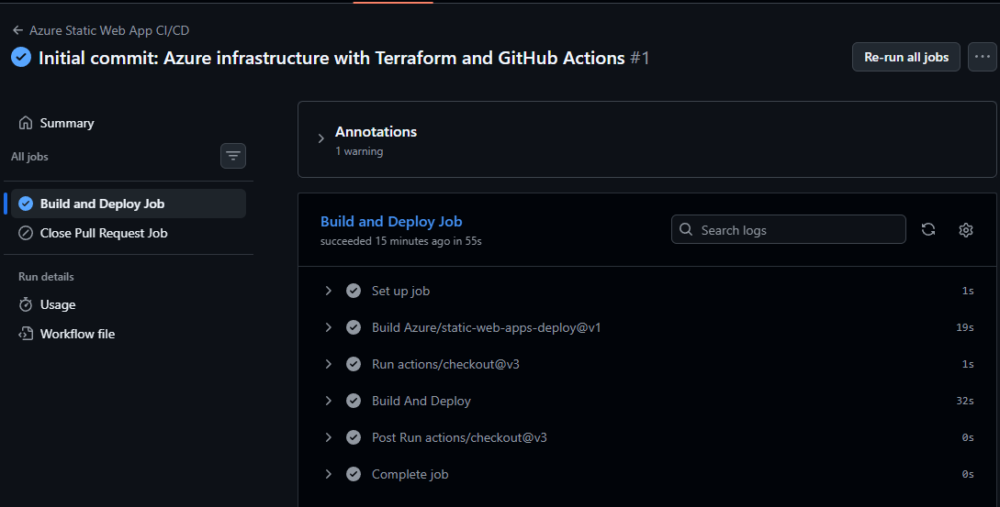
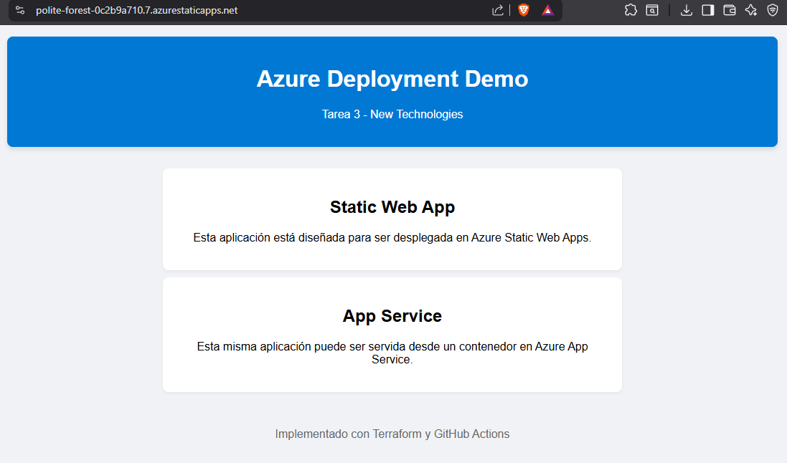

# Evidencia de Implementación: Azure Static Web Apps
**Materia:** New Technologies
**Tarea:** Tarea 3 - Parcial 2
**Nombre del Alumno:** Fernando Augusto Zavala Gómez

---

## 1. Configuración del Pipeline (GitHub Actions)
Se configuró el archivo `webstatic.yml` para detectar cambios en la carpeta `app/` y desplegar automáticamente hacia Azure.

**Explicación:** La imagen muestra la definición del pipeline que utiliza el token de implementación para autenticarse con Azure y subir los archivos estáticos de la carpeta `dist`.

---

## 2. Ejecución Exitosa del Despliegue
Logs de GitHub Actions mostrando que todos los pasos se completaron correctamente.

**Explicación:** Se observa que el proceso de compilación (build) y la carga (upload) a los servidores de Azure se realizaron sin errores.

---

## 3. Aplicación en Producción
Vista de la aplicación funcionando desde la URL oficial proporcionada por Azure.

**Explicación:** La aplicación es accesible públicamente a través de la infraestructura de Azure Static Web Apps, demostrando que el despliegue fue exitoso.
