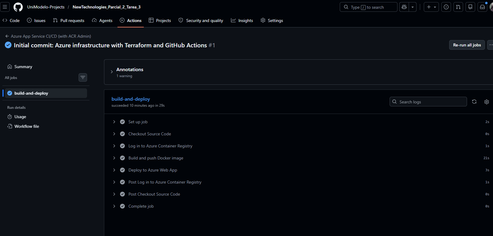
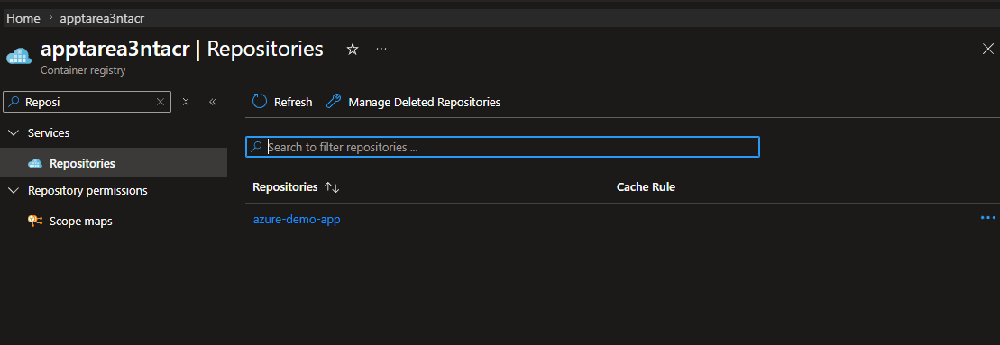
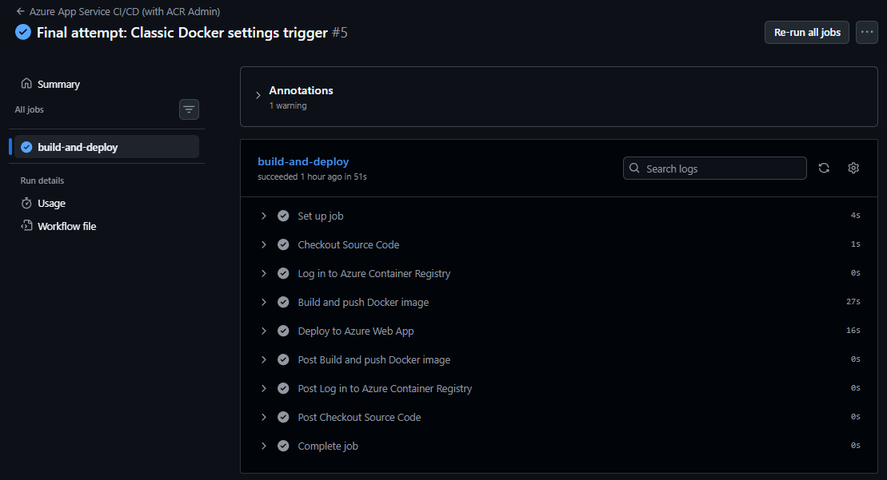
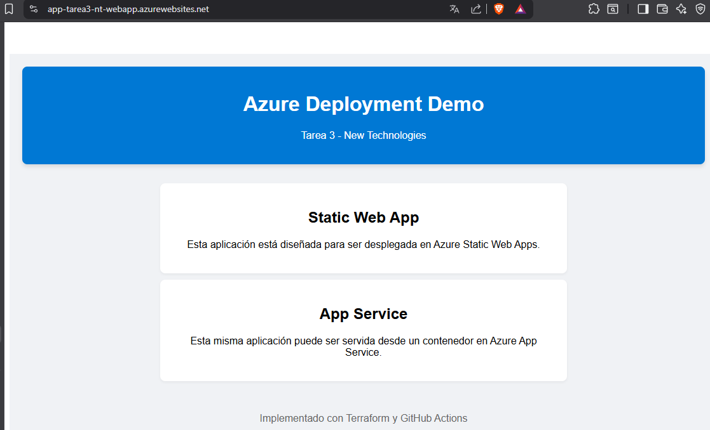

# Evidencia de Implementación: Azure App Service (Docker)
**Materia:** New Technologies
**Tarea:** Tarea 3 - Parcial 2
**Nombre del Alumno:** Fernando Augusto Zavala Gómez

---

## 1. Pipeline y Registro de Contenedores (ACR)
Configuración del flujo para construir la imagen Docker y subirla al Azure Container Registry.

**Explicación:** Se configuró un flujo de trabajo que automatiza la creación de la imagen basada en el Dockerfile y su almacenamiento en el ACR (`apptarea3ntacr`).

---

## 2. Azure Container Registry (ACR)
Evidencia de que la imagen fue recibida en el registro de Azure.

**Explicación:** Se confirma que la imagen Docker se encuentra almacenada correctamente en el registro privado de Azure para ser utilizada por el App Service.

---

## 3. Despliegue en App Service
Confirmación del despliegue exitoso hacia el servicio de aplicaciones de Azure.

**Explicación:** El comando de despliegue notificó al App Service que debe utilizar la nueva versión de la imagen almacenada en el ACR.

---

## 4. Aplicación en Funcionamiento
Vista final de la aplicación corriendo en un contenedor Linux en Azure.

**Explicación:** Se visualiza la aplicación React siendo servida desde un contenedor en Azure App Service.
